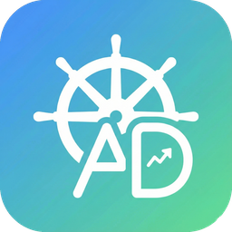
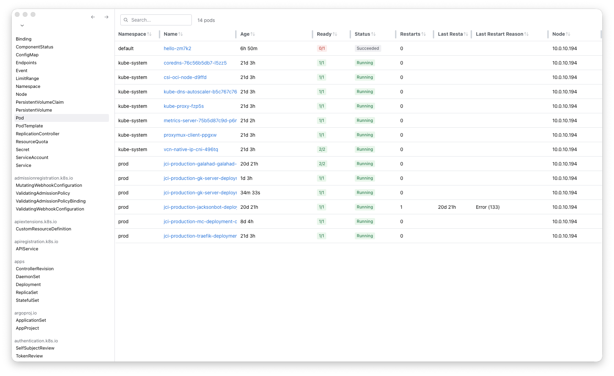
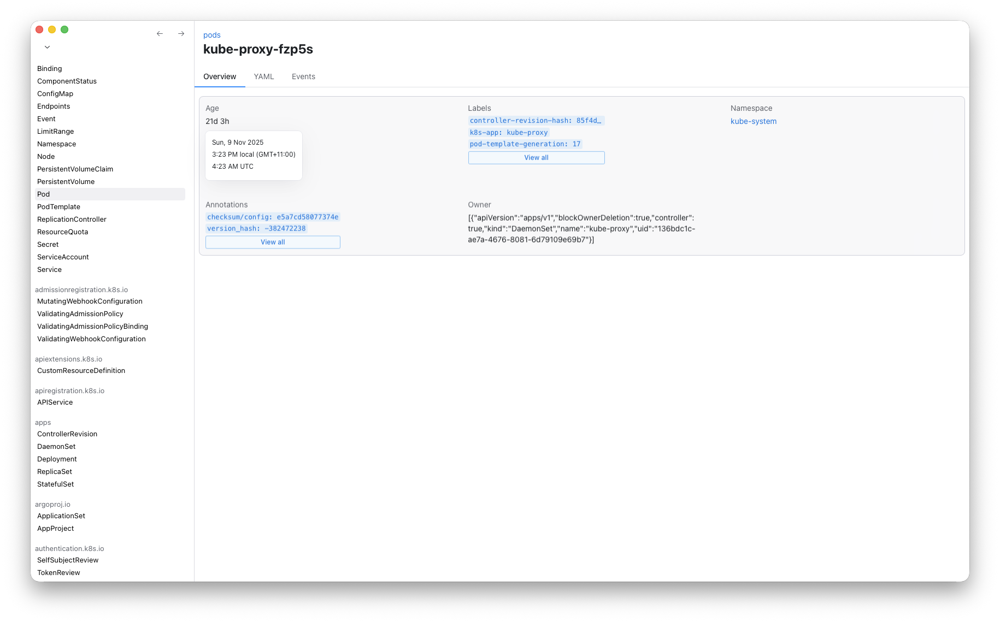

# Kuboid

A GUI companion for managing Kubernetes clusters at scale.

Heavily inspired by [k9s](https://k9scli.io/), a tool I use every day at work and love dearly.

## Principles

Kuboid's development is driven by my own needs as a Kubernetes engineer at a large organisation, with some key principles guiding development:
- Efficiency and speed for program and user is critical
  - Quick traversal between namespaces, resource types, and resources
  - Keybind-driven workflow (with a `k9s`-like keymap) with minimal mouse usage (except when necessary)
  - Design with scale first - 5,000+ pods, 20+ namespaces, CRDs, operators, ArgoCD, Kargo, etc.
- Support for difficult and complex kubeconfig setups
  - Running scripts to generate kubeconfigs, etc (commonly used in enterprise Kube)
  - Namespace isolation
- Get out of the way
  - Always back out to YAML when user interface paradigms fail

## Feature roadmap
- **Connectivity**
  - [x] Select from available contexts (from inferring)
  - [ ] Generate kubeconfigs from script
  - [ ] Distinguish clusters from various cloud providers
  - [ ] Multi-cluster composition
  - [ ] Proxy support
- **Resource table**
  - [x] Discover columns from CRD `additionalPrinterColumns`
  - [ ] Custom column layouts
  - [x] Click-to-sort
  - Well known resource types should have dedicated table layouts:
    - [x] Pod
    - [ ] PVC
    - [ ] PV
    - [ ] Service
    - [ ] Secret/ConfigMap
    - [ ] Node
    - [ ] Namespace(?)
- **Resource view**
  - [x] Overview
  - [x] YAML view
    - [x] Hide managed fields
    - [x] Auto-decode secrets 
    - [ ] Edit
  - [ ] Events view
  - Well-known resource types:
    - Pod
      - [ ] View container info on pane
      - [ ] Logs on each container (+ service)
      - [ ] Port forwarding
      - [ ] Exec into pod
      - [ ] Copy to/from pod
  

## Architecture

Kuboid is a Tauri app with a Rust backend and React frontend. This provides a good balance of easy cross-platform development with acceptable tradeoffs in efficiency.

**Backend** (Rust)
- Uses `kube` package for Kubernetes API communication
- Performs various querying operations and serves data to frontend
- Manages kubeconfig discovery, context selection, and authentication
- Caches resource types with `kube::Discovery`

**Frontend** (React)
- Radix UI with some minor styling changes
- Recoil for managing global state, including the Kubernetes resource cache

## Screenshots

## License

&copy; 2025 Jackson Rakena, MIT License

Please go support [k9s](https://k9scli.io/) — genuinely one of the best tools ever made in the Kubernetes world.